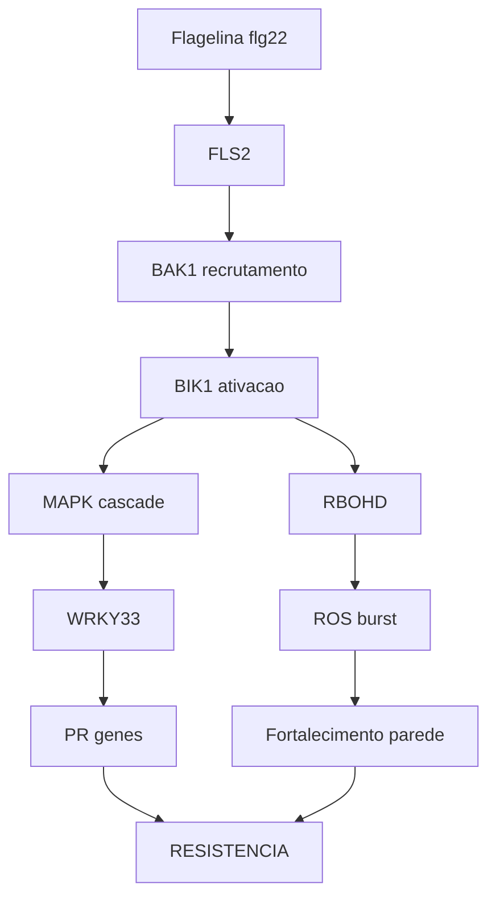
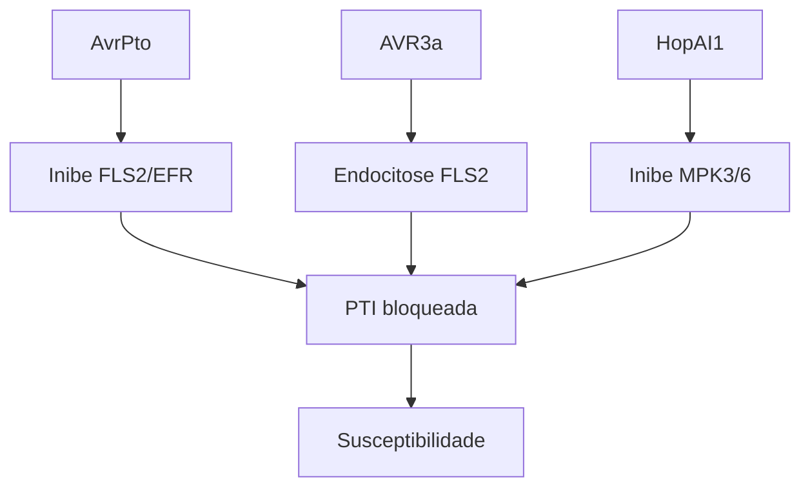
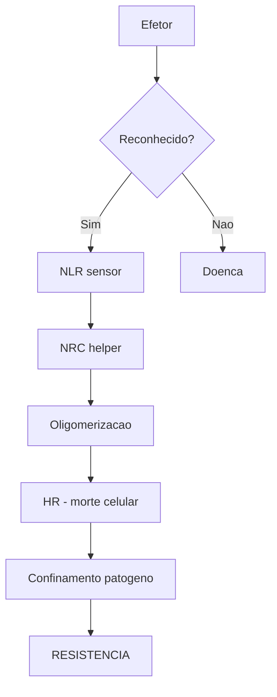
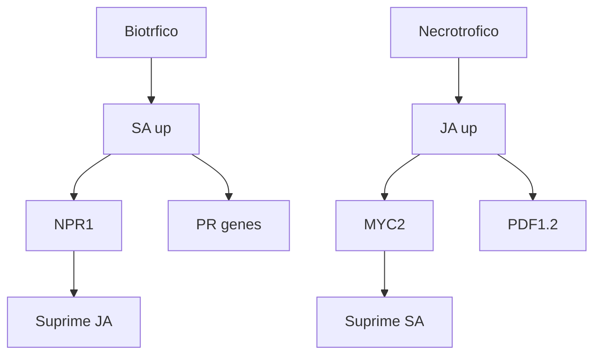

# NBENTHAMIANA_DATABASE.md
## Base de Dados Molecular de Nicotiana benthamiana
> Compilacao massiva para visualizacao de redes genicas e interacoes planta-patogeno

---

# PARTE 1: GENOMA E RECURSOS

## 1.1 Estatisticas do Genoma

| Metrica | Valor | Fonte |
|---------|-------|-------|
| Tamanho do genoma | ~3.1 Gb | [Nature Plants 2023](https://www.nature.com/articles/s41477-023-01489-8) |
| Pseudomolecules | 19 | Sol Genomics Network |
| Scaffolds pequenos | 17,620 | SGN |
| Completude estimada | 99.5% | [Kurotani et al. 2025](https://onlinelibrary.wiley.com/doi/10.1111/tpj.17178) |
| Ploidia | Alotetraploide | - |
| Contigs (HiFi) | 1,668 | [PMC9977260](https://pmc.ncbi.nlm.nih.gov/articles/PMC9977260/) |

## 1.2 Anotacao Genica

| Categoria | Numero | Observacao |
|-----------|--------|------------|
| Transcritos brutos | 237,340 | Montagem de novo |
| Unigenes | 119,014 | Clusterizados |
| Genes com GO terms | 16,169 (13.6%) | Anotados funcionalmente |
| GO Biological Process | 25.5% | - |
| GO Cellular Component | 24.3% | - |
| GO Molecular Function | 24.3% | - |

## 1.3 Databases e Recursos Online

| Recurso | URL | Conteudo |
|---------|-----|----------|
| Sol Genomics Network | https://solgenomics.net | Genoma, BLAST, JBrowse |
| NbenBase | https://nbenthamiana.jp | Plataforma de analise |
| Benthamania | https://www.nbenth.com | Recursos N. benthamiana |
| VPGD | http://vigs.noble.org | VIGS phenomics database |
| SGN-VIGS | https://vigs.solgenomics.net | Clones para silenciamento |

---

# PARTE 2: DEFESA CONTRA PATOGENOS

## 2.1 Sistema Imune de N. benthamiana

### Mutacao Chave: Rdr1

```
Gene: RNA-dependent RNA polymerase 1 (Rdr1)
Defeito: Insercao de 72 nt no exon 1
Consequencia: Terminacao prematura da traducao
Efeito: Sistema de RNA silencing comprometido
       -> Maior susceptibilidade a virus
       -> Ideal para expressao transiente
```

### Outros Genes de Silenciamento Afetados

| Gene | Status | Funcao |
|------|--------|--------|
| RDR1 | Truncado | Silenciamento antiviral |
| DCL3 | Sem DEAD helicase | Processamento de siRNA |
| DCL1 | Funcional | Processamento de miRNA |
| DCL2 | Funcional | siRNA 22 nt |
| DCL4 | Funcional | siRNA 21 nt |

## 2.2 Receptores PRR (Pattern Recognition Receptors)

### Receptores Caracterizados

| Receptor | Ligante (PAMP) | Co-receptor | Patogeno |
|----------|----------------|-------------|----------|
| FLS2 | flg22 (flagelina) | BAK1 | Bacterias |
| EFR | elf18 (EF-Tu) | BAK1 | Bacterias |
| CERK1 | Quitina | LYK5 | Fungos |
| BAK1/SERK3 | Varios | - | Co-receptor universal |

### Cascata de Sinalizacao apos Percepcao de PAMP

```
PAMP (flg22, elf18, quitina)
          |
          v
    PRR (FLS2, EFR, CERK1)
          |
          +-- BAK1 (co-receptor)
          |
          v
    BIK1 (RLCK)
          |
    +-----+-----+-----+
    |     |     |     |
    v     v     v     v
  RBOHD  MAPK  Ca2+  CDPK
   |      |     |     |
   v      v     v     v
  ROS   WRKY  Atividade  Fosforilacao
  burst  TFs   genica    de alvos
```

## 2.3 NRC Network (NLR Required for Cell death)

### Arquitetura em N. benthamiana

```
Sensor NLRs (upstream)
      |
      | ativacao por efetores
      v
Helper NLRs (NRC2, NRC3, NRC4)
      |
      | oligomerizacao
      v
Morte celular (HR)
```

### Componentes Identificados

| NRC | Funcao | Observacao |
|-----|--------|------------|
| NRC2 | Helper principal | Oligomeriza apos ativacao |
| NRC3 | Helper principal | Necessario para HR |
| NRC4 | Helper principal | Network node |
| NRCX | Modulador atipico | Sem MADA funcional, regula negativamente |
| NRG1 | Helper | Regulado por WRKY7 |

### Numero de NLRs em Solanaceae

| Especie | NLRs | Observacao |
|---------|------|------------|
| Tomate | ~320 | Bem caracterizado |
| Batata | >400 | Ancestral de NLRs |
| Pimenta | >400 | Maior arsenAL |
| N. benthamiana | ~300* | Estimado |

---

# PARTE 3: VIAS DE SINALIZACAO

## 3.1 PTI (Pattern-Triggered Immunity)

### Eventos Moleculares

| Evento | Tempo | Moleculas |
|--------|-------|-----------|
| Percepcao | 0-1 min | PRR + PAMP |
| Influxo Ca2+ | 1-5 min | Canais ionicos |
| ROS burst | 5-30 min | RBOHD, superoxido |
| MAPK ativacao | 5-15 min | MPK3, MPK6 |
| Fosforilacao WRKY | 15-30 min | WRKY8, WRKY33 |
| Expressao genica | 30-60 min | PR genes |
| Deposicao calose | 1-6 h | Parede celular |

### Cascata MAPK

```
MEKK1              MAPKKK3/5
  |                   |
  v                   v
MKK1/2             MKK4/5
  |                   |
  v                   v
MPK4              MPK3/MPK6
  |                   |
  v                   v
MKS1, CRCK3        WRKY33, EIN3
```

## 3.2 ETI (Effector-Triggered Immunity)

### Modelo de Reconhecimento

```
                    EFETOR
                      |
        +-------------+-------------+
        |                           |
        v                           v
  Reconhecimento               Supressao
     DIRETO                   de defesa
        |                           |
        v                           |
  Proteina R                        |
  (NLR sensor)                      |
        |                           |
        v                           v
  Helper NLR              PTI comprometida
  (NRC2/3/4)              Doenca
        |
        v
   HR (morte celular)
   Resistencia
```

### Efetores que Disparam ETI em N. benthamiana

| Efetor | Patogeno | Proteina R | Efeito |
|--------|----------|------------|--------|
| AvrPto | P. syringae | Pto/Prf | HR |
| AvrRpm1 | P. syringae | RPM1 | HR via RIN4 |
| AVR3a | P. infestans | R3a | HR |
| Avrblb1 | P. infestans | Rpi-blb1 | HR |
| Avrblb2 | P. infestans | Rpi-blb2 | HR |
| INF1 | P. infestans | NRC dependente | HR |

## 3.3 Hormonios de Defesa

### Acido Salicilico (SA)

```
Biossintese:
Corismato -> ICS1/ICS2 -> Isocorismato
                              |
                              | EDS5 (transporte)
                              v
                         Citoplasma -> SA

Sinalizacao:
SA -> NPR1 (receptor) -> Nucleo
                           |
                           v
                    TGA TFs -> PR genes
```

### Acido Jasmonico (JA)

```
Biossintese:
Acido linolenico -> LOX -> AOS -> AOC -> OPDA -> JA

Sinalizacao:
JA-Ile + COI1 (receptor)
          |
          v
   Degradacao de JAZs
          |
          v
   Liberacao de MYC2
          |
          v
   Expressao de genes JA-responsivos
```

### Crosstalk SA-JA

| Condicao | Dominancia | Mecanismo |
|----------|------------|-----------|
| Biotroficos | SA | NPR1 suprime JA |
| Necrotroficos | JA | JA suprime SA |
| ETI | Ambos | NPR3/4 ativam JA |

---

# PARTE 4: EFETORES DE PATOGENOS

## 4.1 Efetores de Phytophthora infestans (RXLR)

### Efetores Avr Conhecidos (10 caracterizados)

| Efetor | Gene R | Alvo na Planta | Funcao |
|--------|--------|----------------|--------|
| Avr1 | R1 | Sec5 (exocisto) | Manipula secrecao |
| Avr2 | R2 | BSL1 (fosfatase) | Suprime defesa |
| AVR3a | R3a | CMPG1 (E3 ligase) | Estabiliza CMPG1 |
| Avr3b | R3b | ? | ? |
| Avr4 | R4 | ? | ? |
| Avrblb1 | Rpi-blb1 | ? | Altamente expresso |
| AVRblb2 | Rpi-blb2 | C14 (protease) | Bloqueia secrecao |
| Avrvnt1 | Vnt1 | ? | ? |
| AvrSmira1 | Smira1 | ? | ? |
| AvrSmira2 | Smira2 | ? | ? |

### Efetores que Suprimem Defesa

| Efetor | Alvo | Mecanismo |
|--------|------|-----------|
| AVR3a | FLS2/DRP2 | Promove endocitose de PRR |
| AVRblb2 | C14 | Impede secrecao de protease |
| PvRXLR159 | ? | Suprime HR por INF1 e BAX |
| Pi04089 | Varios | Perturba genes de defesa |
| Pi05910 | GOX4 | Destabiliza oxidase |

## 4.2 Efetores de Pseudomonas syringae (T3SS)

### Principais Efetores Tipo III

| Efetor | Alvo | Funcao | Reconhecido por |
|--------|------|--------|-----------------|
| AvrPto | FLS2/EFR | Inibe fosforilacao de PRR | Pto/Prf |
| AvrPtoB | FLS2/BAK1 | E3 ligase, degrada PRRs | Pto/Prf |
| AvrRpm1 | RIN4 | Fosforila RIN4 | RPM1 |
| AvrB | RIN4 | Fosforila RIN4 | RPM1 |
| AvrRpt2 | RIN4 | Cliva RIN4 | RPS2 |
| HopAI1 | MPK3/MPK6 | Inibe MAPK | SUMM2 |
| HopQ1 | SGT1 | Modula morte celular | - |
| HopG1 | Mitocondria | Altera metabolismo | - |
| HopD1 | NHR2B | Interfere com dinamica celular | - |

## 4.3 Localizacao Subcelular de Efetores

| Compartimento | Efetores | Funcao |
|---------------|----------|--------|
| Membrana plasmatica | AvrPto, AvrRpm1 | Alvo PRRs |
| Citoplasma | AVR3a, HopAI1 | Inibe sinalizacao |
| Nucleo | TAL effectors | Ativa genes do hospedeiro |
| Cloroplasto | HopI1, HopK1 | Suprime ROS |
| Mitocondria | HopG1 | Altera respiracao |
| Apoplasto | Avrblb2 alvo | Protease C14 |

---

# PARTE 5: FATORES DE TRANSCRICAO

## 5.1 Familia WRKY em N. benthamiana

### Numeros

| Metrica | Valor |
|---------|-------|
| Total NbWRKY | 118 genes |
| Induzidos por herbivoria | 9 genes |
| Reguladores de lignina | Varios |

### WRKYs Caracterizados

| Gene | Funcao | Regulacao | Referencia |
|------|--------|-----------|------------|
| WRKY7 | Regula NRG1 | Ativa helper NLR | [Oxford 2025](https://academic.oup.com/plphys) |
| WRKY8 | Alvo de MAPK | Fosforilado por MPK3/6 | [PMC3082260](https://pmc.ncbi.nlm.nih.gov/articles/PMC3082260/) |
| WRKY22 | Regulador positivo | AvrPto responsivo | [Springer](https://link.springer.com/article/10.1007/s11103-020-01069-w) |
| WRKY25 | Regulador positivo | ETI responsivo | [Springer](https://link.springer.com/article/10.1007/s11103-020-01069-w) |
| WRKY33 | Alvo de MPK3/6 | Biosintese camalexina | - |

### Alvos de WRKY

```
WRKY -> W-box (TTGACC/T) no promotor

Genes regulados:
- PR1, PR2, PR5 (pathogenesis-related)
- PDF1.2 (defensina)
- FRK1 (receptor quinase)
- Genes de biosintese de SA
```

## 5.2 Outros TFs de Defesa

| Familia | Membros chave | Funcao |
|---------|---------------|--------|
| MYC | MYC2 | Sinalizacao JA |
| TGA | TGA1, TGA2 | Sinalizacao SA |
| ERF | ERF1, ORA59 | Etileno/JA |
| NAC | ANAC055, ANAC019 | Senescencia, defesa |
| bZIP | bZIP10, bZIP60 | Estresse ER |

---

# PARTE 6: COMPONENTES CELULARES

## 6.1 ROS Burst

### RBOHD - O Principal Produtor de ROS

```
Estrutura:
N-terminal: EF-hands (ligam Ca2+)
           Sitios de fosforilacao (S39, S343, S347, S862)
Central:    Dominio FAD
C-terminal: Dominio NADPH

Ativacao:
1. PAMP -> PRR
2. Influxo de Ca2+
3. Ca2+ liga EF-hands
4. CPKs fosforilam RBOHD
5. Mudanca conformacional
6. Transferencia de eletrons: NADPH -> FAD -> O2
7. Producao de O2.- (superoxido)
8. SOD converte a H2O2
```

### Regulacao de RBOHD

| Regulador | Tipo | Efeito |
|-----------|------|--------|
| BIK1 | Quinase | Fosforila S39 |
| CPK5 | Quinase | Fosforila apos Ca2+ |
| PBL13 | Quinase | Regula abundancia |
| PIRE | E3 ligase | Ubiquitina/degrada |
| PP2C | Fosfatase | Inativa |

### Funcoes do ROS

| Funcao | Mecanismo |
|--------|-----------|
| Killing direto | Oxidacao de proteinas/DNA do patogeno |
| Sinalizacao | H2O2 como segundo mensageiro |
| Crosslinking | Fortalece parede celular |
| HR | Contribui para morte celular |

## 6.2 Organelas na Defesa

### Cloroplasto

| Funcao Imune | Mecanismo |
|--------------|-----------|
| Biossintese de SA | Via ICS1 |
| Biossintese de JA | Via LOX/AOS |
| Producao de ROS | Cadeia de eletrons |
| Reservatorio de Ca2+ | Sinalizacao |
| Retrograde signaling | Comunicacao com nucleo |
| Contato com membrana | MCS com haustorios |

### Mitocondria

| Funcao | Mecanismo |
|--------|-----------|
| ATP para defesa | Respiracao |
| ROS mitocondrial | Cadeia de eletrons |
| PCD | Liberacao citocromo c |
| Coordenacao com cloroplasto | Sinalizacao |

---

# PARTE 7: DATASETS PUBLICOS

## 7.1 Transcriptomas Disponiveis (GEO/SRA)

| Acesso | Patogeno/Condicao | Amostras | Referencia |
|--------|-------------------|----------|------------|
| GSE4686 | Baseline | Varios | OmicsDI |
| GSE62193 | Infeccao | Varios | NCBI GEO |
| - | TbCSV (virus) | 59,814 unigenes | [PMC6122796](https://www.ncbi.nlm.nih.gov/pmc/articles/PMC6122796/) |
| - | P. fluorescens | 9 tecidos | [Nature](https://www.nature.com/articles/s41598-018-38247-2) |
| - | P. palmivora | Time-series | [BMC Biology](https://bmcbiol.biomedcentral.com/articles/10.1186/s12915-017-0379-1) |
| - | P. parasitica | Comparativo | [Plant Growth Reg](https://link.springer.com/article/10.1007/s10725-016-0163-1) |

## 7.2 Bancos de Dados de Efetores

| Banco | URL | Conteudo |
|-------|-----|----------|
| PHI-base | www.phi-base.org | 10,614 genes, 335 patogenos |
| PHI-base v4.18 | - | 2,261 interacoes com efetores |
| EffectorP | - | Predicao ML |
| SignalP | - | Peptideos sinal |

## 7.3 Interactomas

| Banco | Conteudo | Uso |
|-------|----------|-----|
| STRING | Redes proteicas | Predicao de interacao |
| IntAct | Interacoes curadas | Validacao experimental |
| BioGRID | 2.9M interacoes | Modelo de referencia |
| AtPID | Arabidopsis | Ortologia |
| PlaPPISite | Sites de interacao | Analise estrutural |

---

# PARTE 8: VIAS PARA VISUALIZACAO

## 8.1 Via 1: PTI Classica



## 8.2 Via 2: Supressao por Efetor



## 8.3 Via 3: ETI e HR



## 8.4 Via 4: Crosstalk SA-JA



---

# PARTE 9: CONSEQUENCIAS CELULARES

## 9.1 Mapa de Impacto por Compartimento

| Efetor/Via | Membrana | Citoplasma | Nucleo | Cloroplasto | Mitocondria |
|------------|----------|------------|--------|-------------|-------------|
| FLS2 ativado | Influxo Ca2+ | MAPK | WRKY | - | - |
| RBOHD | ROS externo | - | - | - | - |
| AvrPto | PRR inibido | - | - | - | - |
| HopG1 | - | - | - | - | Alterado |
| ETI/HR | Permeabilidade | - | DNA fragmentado | ROS | PCD |

## 9.2 Efeitos Visiveis para Visualizacao

### Membrana Plasmatica

| Evento | Causa | Visualizacao Sugerida |
|--------|-------|----------------------|
| Influxo Ca2+ | PAMP | Membrana "pulsa" verde |
| Efflux K+ | ROS | Membrana "despolariza" |
| Endocitose PRR | Efetor | PRR "some" da membrana |
| Permeabilizacao | HR | Membrana "rompe" |

### Cloroplasto

| Evento | Causa | Visualizacao |
|--------|-------|--------------|
| Producao SA | PTI | Cloroplasto "brilha" amarelo |
| Producao JA | Dano | Cloroplasto "brilha" azul |
| ROS burst | Estresse | Cloroplasto "vermelho" |
| Degradacao | HR | Cloroplasto "fragmenta" |

### Nucleo

| Evento | Causa | Visualizacao |
|--------|-------|--------------|
| WRKY entrada | MAPK | Nucleo "acende" |
| Transcricao PR | SA | Genes "expressando" |
| Fragmentacao DNA | HR | Nucleo "dissolve" |

---

# PARTE 10: DADOS PARA IMPLEMENTACAO

## 10.1 Genes Prioritarios para Rede

### Receptores (Nodes de entrada)

| Gene | Tipo | Grau esperado |
|------|------|---------------|
| FLS2 | PRR | Alto - hub |
| EFR | PRR | Alto - hub |
| BAK1 | Co-receptor | Muito alto |
| CERK1 | PRR | Medio |

### Sinalizacao (Nodes intermediarios)

| Gene | Tipo | Grau |
|------|------|------|
| BIK1 | RLCK | Alto |
| MPK3 | MAPK | Muito alto |
| MPK6 | MAPK | Muito alto |
| MPK4 | MAPK | Alto |
| RBOHD | Oxidase | Alto |

### TFs (Nodes reguladores)

| Gene | Tipo | Grau |
|------|------|------|
| WRKY33 | TF | Alto |
| WRKY22 | TF | Alto |
| MYC2 | TF | Alto |
| NPR1 | Receptor SA | Muito alto |

### Outputs (Genes efetores)

| Gene | Tipo | Regulacao |
|------|------|-----------|
| PR1 | Defesa | SA up |
| PR2 | Glucanase | SA up |
| PR5 | Thaumatina | SA up |
| PDF1.2 | Defensina | JA up |
| FRK1 | Quinase | PTI marker |

## 10.2 Edges (Interacoes)

### Tipo 1: Ativacao

| Source | Target | Peso | Evidencia |
|--------|--------|------|-----------|
| FLS2 | BAK1 | 0.95 | Experimental |
| BAK1 | BIK1 | 0.90 | Experimental |
| BIK1 | RBOHD | 0.85 | Fosforilacao |
| MPK3 | WRKY33 | 0.88 | Fosforilacao |
| WRKY33 | PR1 | 0.75 | ChIP-seq |

### Tipo 2: Repressao

| Source | Target | Peso | Evidencia |
|--------|--------|------|-----------|
| JAZ1 | MYC2 | -0.90 | Experimental |
| NPR1 | JA_genes | -0.70 | SA-JA crosstalk |
| AvrPto | FLS2 | -0.95 | Inibicao |

## 10.3 Anotacoes para Categorias

```json
{
  "gene_categories": {
    "PRR": ["FLS2", "EFR", "CERK1", "BAK1"],
    "MAPK": ["MPK3", "MPK4", "MPK6", "MKK1", "MKK4"],
    "TF": ["WRKY33", "WRKY22", "MYC2", "NPR1", "TGA1"],
    "Oxidase": ["RBOHD", "RBOHF"],
    "Defense": ["PR1", "PR2", "PR5", "PDF1.2", "FRK1"],
    "NLR": ["NRC2", "NRC3", "NRC4", "NRCX", "NRG1"],
    "Effector_target": ["RIN4", "C14", "CMPG1", "Sec5"]
  },
  "cellular_location": {
    "membrane": ["FLS2", "EFR", "BAK1", "RBOHD"],
    "cytoplasm": ["MPK3", "MPK6", "BIK1"],
    "nucleus": ["WRKY33", "NPR1", "MYC2"],
    "chloroplast": ["ICS1", "LOX"],
    "apoplast": ["PR1", "PR2", "C14"]
  }
}
```

---

# FONTES E REFERENCIAS

## Artigos Principais

1. [Multi-omic N. benthamiana resource](https://www.nature.com/articles/s41477-023-01489-8) - Nature Plants 2023
2. [Genome and Analysis](https://pmc.ncbi.nlm.nih.gov/articles/PMC9977260/) - Plant Cell Physiol 2023
3. [Web analysis platform](https://onlinelibrary.wiley.com/doi/10.1111/tpj.17178) - Plant Journal 2025
4. [PTI-ETI synergy](https://pmc.ncbi.nlm.nih.gov/articles/PMC11258992/) - Plant Biotech J 2024
5. [NRC network](https://pmc.ncbi.nlm.nih.gov/articles/PMC9851556/) - PLoS Genetics 2023
6. [WRKY genome-wide](https://www.sciencedirect.com/science/article/abs/pii/S0926669024016327) - 2024
7. [PHI-base](https://academic.oup.com/nar/article/48/D1/D613/5626528) - NAR 2020
8. [SA-JA immunity](https://pmc.ncbi.nlm.nih.gov/articles/PMC12058309/) - 2025
9. [RBOHD regulation](https://www.nature.com/articles/s41467-020-15601-5) - Nat Commun 2020
10. [Chloroplast immunity](https://www.cell.com/plant-communications/fulltext/S2590-3462(25)00182-8) - 2025

---

*Documento gerado em: 2026-03-02*
*Versao: 1.0*
*Para uso no Bioinformatics Hub*
